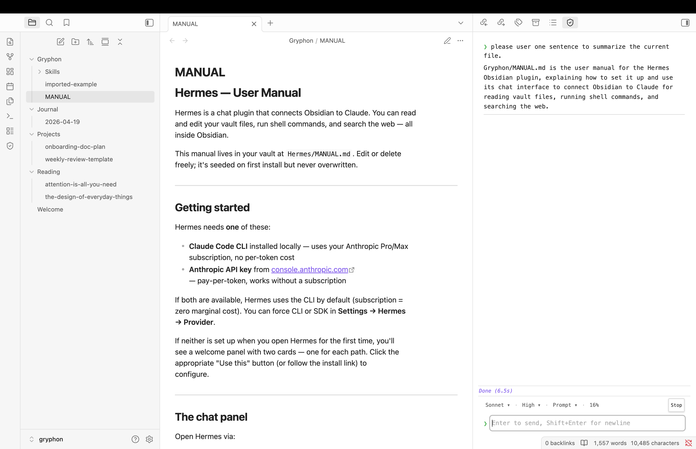
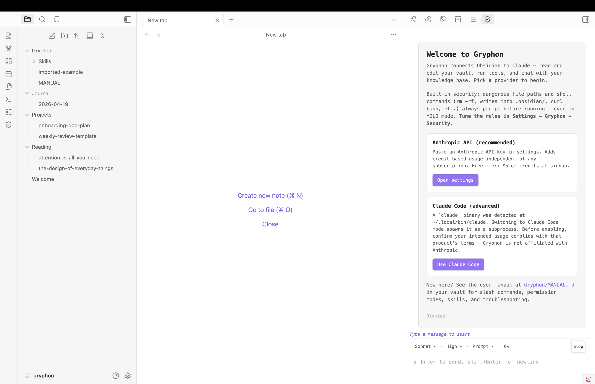
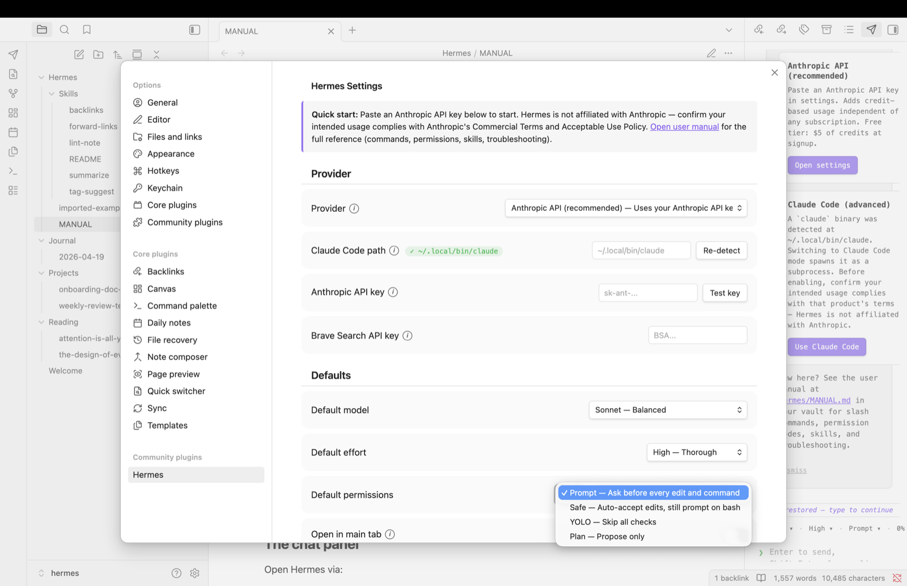
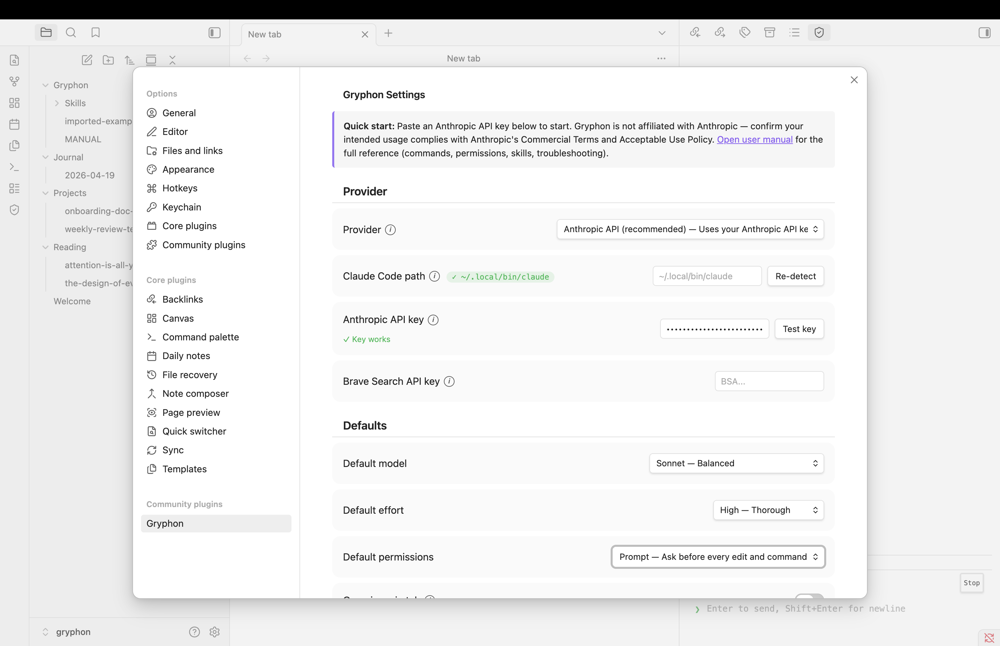
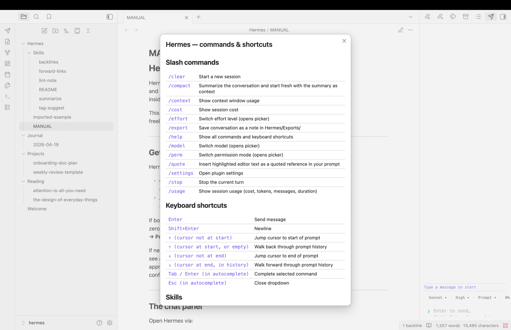

# Gryphon

> **Were you using Hermes?** This plugin was briefly published as **Hermes** at v1.0.0 and renamed to **Gryphon** to avoid confusion with the gaining-mindshare Hermes agentic system. Same project, same security model, same code lineage. Migration: install Gryphon via BRAT (`polleoai/gryphon`), then copy `.obsidian/plugins/hermes/data.json` → `.obsidian/plugins/gryphon/data.json` to keep your API key and settings. The plugin auto-renames the `Hermes/` vault folder to `Gryphon/` on first launch. The historical Hermes repo is archived at [polleoai/hermes](https://github.com/polleoai/hermes).

AI chat for Obsidian. Talk to Claude, GPT, or Gemini from inside your vault — read and edit files, run tools, all without leaving Obsidian.

Gryphon is a lightweight, reactive chat surface that connects your Obsidian vault to one of six LLM providers: Anthropic's Claude API, OpenAI's API, or Google's Gemini API directly, or any of their locally-installed CLI subprocesses (`claude`, `codex`, `gemini`). It runs on your local machine and reads/writes your vault files through a standard tool-use loop. Pick whichever provider you already have credentials for — there's no preference baked in.

> Gryphon is not affiliated with Anthropic, OpenAI, or Google. References to the Anthropic API, OpenAI API, Google API, or any of their CLIs describe what the plugin can talk to; they do not imply endorsement. When using a CLI-subprocess mode, confirm your intended usage complies with that product's terms.

## Screenshots

| | |
|---|---|
|  |  |
| Chat panel with streaming response — note `Gryphon/MANUAL.md` in the file tree, seeded on first install | First-run welcome panel adapts to what's detected (API key, local CLI, or neither) |
|  |  |
| Edit permission modal with diff preview | Settings tab — provider chooser, API key fields, defaults |
|  | |
| `/help` modal — slash commands, keyboard shortcuts, link to the in-vault manual | |

## Features

- **Built-in security layer** — a curated list of dangerous file paths (`.obsidian/`, `.git/`, `.claude/`, `.env`, ...) and commands (`rm -rf`, `Remove-Item -Recurse`, `curl | bash`, `format C:`, `sudo`, registry mutation, ...) always surface an approval modal **even in YOLO mode**. Other Claude-for-Obsidian plugins defer entirely to Claude Code's permission modes — Gryphon adds a dedicated guardrail so a one-word "yes" in YOLO can't wipe your vault. See **Built-in security** below for the full model.
- **Streaming chat panel** in a sidebar or main tab
- **Vault-native tooling** — Claude reads, writes, edits, searches, and runs shell commands with the vault as its working directory
- **Anthropic API by default** — connects to the Anthropic API directly. A Claude Code (local-CLI) mode is available as an advanced opt-in.
- **Permission modes** — Prompt, Safe (auto-accept edits), YOLO (skip all prompts), Plan (propose only). Independent of the built-in security layer above.
- **Approve-per-call modal** — every tool-use that matches one of your protected patterns surfaces in an Obsidian dialog with diff/command preview before it runs. Works in both Anthropic API mode and Claude Code mode on macOS, Linux, and Windows.
- **Untrusted-content framing** — web fetches, shell output, and out-of-vault reads are tagged when Claude sees them, so prompt injection in fetched content can't redirect the conversation
- **Per-file provenance** — files written from a web fetch are persistently flagged; subsequent reads show Claude the original source and treat the content as data, even after a plugin reload
- **Session persistence** — conversations survive plugin reloads, including full model context in Anthropic API mode
- **Auto-compact at 95%** *(SDK mode)* — Gryphon automatically summarizes the conversation and starts a fresh session seeded with the summary when the context window fills up; a status-line warning at 80% lets you intervene with `/compact` first if you'd rather control the summary yourself. Claude Code mode delegates to Claude Code's own auto-compaction.
- **Skill loader** — `.md` files in `Gryphon/Skills/` become slash commands; five skills ship pre-populated
- **Terminal-style input** — ↑/↓ jump cursor to start/end of prompt, or walk through prompt history
- **Slash commands** — `/clear`, `/compact`, `/context`, `/cost`, `/effort`, `/export`, `/model`, `/perm`, `/quote`, `/settings`, `/stop`, `/usage`

## Installation

**Via Obsidian's Community Plugins directory** — search for "Gryphon" in Obsidian → Settings → Community plugins → Browse, or open `obsidian://show-plugin?id=gryphon` directly. This is the recommended path for most users.

**Via BRAT** *(for early access to release candidates)* — the [Beta Reviewers Auto-update Tool](https://github.com/TfTHacker/obsidian42-brat) is a community plugin that installs plugins directly from GitHub releases and keeps them up to date.

1. Install BRAT from Obsidian's Community Plugins directory (search for "BRAT").
2. Open **Settings → BRAT → Add Beta Plugin**.
3. Paste `polleoai/gryphon` and click "Add Plugin". BRAT pulls the latest release.
4. Enable Gryphon in **Settings → Community plugins**.
5. Future releases auto-update through BRAT.

**From source** *(for contributors)*:
1. Clone the repo into `.obsidian/plugins/gryphon/` (relative to your vault root)
2. Run `npm install` and `npm run build`
3. In Obsidian → Settings → Community plugins → enable Gryphon

## Requirements

You need **at least one** of the following — Gryphon picks up whichever provider you have credentials for:

- **Anthropic API key** from [console.anthropic.com](https://console.anthropic.com) (Claude models, pay-per-token)
- **OpenAI API key** from [platform.openai.com](https://platform.openai.com) (GPT models, pay-per-token)
- **Google API key** from [aistudio.google.com](https://aistudio.google.com) (Gemini models, free tier available)
- **A locally-installed AI CLI** — `claude`, `codex`, or `gemini`. Gryphon detects whichever is on your `PATH`.

Paste the API key for your chosen provider into **Settings → Gryphon → <Provider> API key**, or set the corresponding env var (`ANTHROPIC_API_KEY`, `OPENAI_API_KEY`, `GOOGLE_API_KEY`). The plugin reads from settings first, env var as fallback.

Each provider mode is independent — you can switch between them per-conversation via `/model` or globally in Settings. Before using any CLI-subprocess mode, confirm your intended usage complies with that product's terms.

## Provider modes

Six providers shipping today, plus an Auto-detect mode:

| Mode | How it works |
|---|---|
| **Anthropic API** | Direct HTTP calls to `api.anthropic.com` via `@anthropic-ai/sdk`. Pay-per-token. |
| **OpenAI API** | Direct HTTP calls to `api.openai.com` via the official `openai` SDK. Pay-per-token. |
| **Google API** | Direct HTTP calls to `generativelanguage.googleapis.com` via `@google/genai` (Gemini Developer API; Vertex AI also supported when credentials present). Free tier available. |
| **Claude Code** | Spawns a locally-installed `claude` binary as a subprocess and streams JSON over stdin/stdout. Requires Anthropic's CLI installed locally. |
| **Codex CLI** | Same pattern for OpenAI's `codex` CLI. |
| **Gemini CLI** | Same pattern for Google's `gemini` CLI. |
| **Auto** | Prefers any detected CLI (claude > codex > gemini priority), else falls back to whichever API key is configured. Opt-in; not the default. |

For CLI modes, confirm your intended usage complies with that product's Commercial Terms and Acceptable Use Policy. API modes require credits in the corresponding vendor's workspace.

## Permission modes

Claude's ability to edit your files and run shell commands is gated by the Permission setting:

| Mode | Read tools | Normal edits | Normal shell | Protected path / command |
|---|---|---|---|---|
| **Prompt** (default) | Always allowed | Modal per file | Modal per command | Modal (always) |
| **Safe** | Always allowed | Auto-accept | Modal per command | **Modal (always)** |
| **YOLO** | Always allowed | Auto-accept | Auto-accept | **Modal (always)** |
| **Plan** | Always allowed | Refused | Refused | Refused |

Prompts include a preview: Edit shows old/new diff, Write shows the first 30 lines of content, Bash shows the full command with its working directory. You can tick "Remember for this session" to skip future prompts for the same file until plugin reload. Bash decisions are never cached — every command is asked individually.

All file operations are **vault-scoped**: paths like `../etc/passwd` are rejected before the tool runs, even in YOLO mode. Security boundary is `src/providers/anthropic-api/tools/path-utils.js`.

## Built-in security (what makes Gryphon different)

Most Claude-for-Obsidian integrations rely entirely on the user's vigilance at each approval prompt plus Claude Code's own permission modes. Gryphon adds a curated layer on top: a pre-populated list of known-dangerous **file-path patterns** (writes into `.obsidian/`, `.git/`, `.claude/`, `.env`) and **command patterns** (`rm -rf`, `Remove-Item -Recurse`, `curl | bash`, `iwr | iex`, `sudo`, `format C:`, registry mutation, recursive chmod, etc.) that **always** surface an approval modal before running — including in YOLO mode.

The design choice: convenience modes (Safe, YOLO) silence prompts for _routine_ operations so Claude can iterate quickly; a separate rule set guards the _dangerous_ ones so you can't accidentally YOLO away your vault, your git history, or your shell. The two axes are independent.

Users stay in full control of the rule set:

- **Settings → Gryphon → Security → Protect file paths / Protect commands**: per-feature master toggle if you want to rely on Claude Code's modes alone
- **Settings → Gryphon → Security**: per-pattern checkboxes (default rules + your own additions) for fine-grained tuning
- Custom paths accept literal strings (trailing `/` = folder prefix); custom commands accept JavaScript regex

Every default pattern is listed with a user-readable "why this matters" tooltip so non-developers can decide whether to keep or uncheck it.

## Privacy and data flow

Gryphon is local-first. The short version:

- **Your API key** lives in `.obsidian/plugins/gryphon/data.json` (inside your vault) alongside other Obsidian plugin data. It is sent only as an `x-api-key` header to `api.anthropic.com` when Anthropic API mode is active. Never logged, never exported, never sent anywhere else.
- **Vault content** is sent to the Anthropic API (Anthropic API mode) or to the locally-installed `claude` subprocess (Claude Code mode) only when Claude invokes a Read/Grep/Glob/Write/Edit/Bash tool on your behalf during an active conversation. Outside an active turn, nothing leaves your machine.
- **Chat history** persists to `chat-history.json` in the plugin directory. In Claude Code mode, LLM turns also live in Claude Code's own session files under `~/.claude/projects/` (owned by Claude Code, not Gryphon — delete the relevant session file to rotate the Claude Code session).
- **No telemetry.** Gryphon does not include analytics, crash reporting, or any opt-out-required data collection. There is no "phone home" path.
- **Diagnostics are opt-in.** **Settings → Gryphon → Diagnostics → CLI debug logging** turns on console-side debug output and hook-invocation tracing. Everything it produces is console or local-file only; nothing is sent off-device. Default off.

What leaves your machine:

| Action | Destination | When |
|---|---|---|
| Chat message (Anthropic API mode) | `api.anthropic.com` | Per turn |
| Chat message (OpenAI API mode) | `api.openai.com` | Per turn |
| Chat message (Google API mode) | `generativelanguage.googleapis.com` (Gemini API) or `aiplatform.googleapis.com` (Vertex AI) | Per turn |
| Chat message (CLI mode) | Local `claude` / `codex` / `gemini` subprocess on your machine | Per turn |
| Vault file read by Claude | Same as above, embedded in the turn | Only when Claude invokes a Read tool |
| WebFetch URL | The URL's origin (direct HTTP fetch) | Only when Claude invokes WebFetch |
| WebSearch query | `api.search.brave.com` (SDK with key) or the provider's built-in search (CLI) | Only when Claude invokes WebSearch |
| Everything else | Nowhere | Ever |

The provider mode you select determines which endpoint the plugin reaches. Unused providers contact nothing. No analytics, crash reporting, or telemetry endpoint exists in Gryphon — there is no "phone home" path.

### Bundled SDKs and their full endpoint surface

Gryphon bundles the official SDKs from the providers it supports (`@anthropic-ai/sdk`, `openai`, `@google/genai`, `undici`). The Obsidian Community Plugins scorecard reports all endpoint strings present in the bundle, including endpoints that are only reached in specific auth flows — for example, Google's `@google/genai` SDK probes Google Cloud metadata endpoints (`169.254.169.254`, `metadata.google.internal`, `iamcredentials.googleapis.com`, `cloudresourcemanager.googleapis.com`, `oauth2.googleapis.com`, `accounts.google.com`) when running inside a Google Cloud VM with Application Default Credentials. None of those are reached during normal Obsidian use on a desktop machine; they remain in the bundle because the SDK ships them.

The complete list of domains that *could* be contacted, by mode:

- **Anthropic API mode**: `api.anthropic.com`
- **OpenAI API mode**: `api.openai.com`, `auth.openai.com` (only during OAuth flows if used)
- **Google API mode**: `generativelanguage.googleapis.com`, `aiplatform.googleapis.com`, and (only inside Google Cloud) the metadata + auth endpoints listed above
- **WebSearch (any API mode)**: `api.search.brave.com`
- **WebFetch (any mode)**: whatever URL Claude is told to fetch — by definition arbitrary
- **CLI modes**: nothing direct (the CLI subprocess makes its own outbound requests on your machine)

### System identity reads

Gryphon's CLI-detection logic reads a small amount of system information:

- `os.hostname()` and `os.userInfo()` — used in cross-platform path normalization for hook scripts
- Environment variables — `PATH`, `HOME`, `ANTHROPIC_API_KEY`, `OPENAI_API_KEY`, `GOOGLE_API_KEY`, `GRYPHON_VAULT`, `npm_config_*`, plus platform-standard locations Claude Code / Codex / Gemini CLIs are typically installed under

None of this is transmitted off the device.

### Vault access surface

Gryphon uses Obsidian's standard vault API: `vault.read`, `vault.cachedRead`, `vault.modify`, `vault.create`, `vault.delete`, `vault.rename`. All operations are vault-scoped — paths like `../etc/passwd` are rejected before the tool runs, regardless of permission mode.

For vulnerability reports and the full data-handling breakdown, see [SECURITY.md](./SECURITY.md).

## Skills

A skill is a `.md` file in the `Gryphon/Skills/` folder of your vault, with YAML frontmatter:

```markdown
---
name: tag-suggest
description: Propose tags for the active note
argument-hint: optional extra context
---
Read the active note and propose 3-5 tags that capture its core topics.
Tags should be lowercase-with-hyphens, avoid over-general terms, and
reference existing tags in the vault when possible.

{{args}}
```

Once saved, type `/tag-suggest` in Gryphon chat to invoke it. `{{args}}` expands to anything typed after the skill name.

Pre-populated skills include `/tag-suggest`, `/backlinks`, `/forward-links`, `/summarize`, `/lint-note`. Delete them from `Gryphon/Skills/` if you don't want them; they won't be re-created.

## Settings reference

| Setting | Purpose |
|---|---|
| **Provider** | Auto / Anthropic API / OpenAI API / Google API / Claude Code / Codex CLI / Gemini CLI (see Provider modes above) |
| **Anthropic API key** | For Anthropic API mode. Stored in `data.json`. Blank = check `ANTHROPIC_API_KEY` env var. |
| **OpenAI API key** | For OpenAI API mode. Stored in `data.json`. Blank = check `OPENAI_API_KEY` env var. |
| **Google API key** | For Google API mode. Stored in `data.json`. Blank = check `GOOGLE_API_KEY` env var. |
| **Claude Code path** | Path to `claude` binary. Leave blank for auto-detect. Used in Claude Code mode only. |
| **Codex CLI path** | Path to `codex` binary. Leave blank for auto-detect. Used in Codex CLI mode only. |
| **Gemini CLI path** | Path to `gemini` binary. Leave blank for auto-detect. Used in Gemini CLI mode only. |
| **Brave Search API key** | Enables WebSearch in any API mode. Free tier at [brave.com/search/api](https://brave.com/search/api/). CLI modes use the provider's built-in search and ignore this. |
| **Default model** | Provider-dependent dropdown (e.g., Claude Haiku/Sonnet/Opus, GPT-4o/o1, Gemini Flash/Pro). |
| **Default effort** | Low / Medium / High (where the provider's API exposes a reasoning-effort parameter). |
| **Permissions** | Prompt / Safe / YOLO / Plan (see Permission modes above) |
| **Open in main tab** | Opens chat in main editor area instead of sidebar |

## Keyboard shortcuts

| Key | Action |
|---|---|
| **Enter** | Send message |
| **Shift+Enter** | Newline |
| **↑** (cursor not at start) | Jump cursor to start of prompt |
| **↑** (cursor at start) | Walk back through prompt history |
| **↓** (cursor not at end) | Jump cursor to end of prompt |
| **↓** (cursor at end, in history) | Walk forward through prompt history |
| **Tab / Enter** in autocomplete | Complete selected command |
| **Esc** in autocomplete | Close dropdown |

## Architecture

Gryphon is structured around a pluggable provider interface:

```
src/
├── plugin.js                    — Obsidian plugin entry + settings UI
├── chat-view.js                 — streaming chat UI
├── constants.js                 — slash commands, models, permission modes
├── skills.js                    — skill file loader + dynamic slash commands
├── bundled-skills.js            — pre-populated skill content
├── utils.js                     — shared helpers
└── providers/
    ├── provider-interface.js    — contract doc (JSDoc-only)
    ├── factory.js               — selects CLI or SDK based on settings
    ├── cli/
    │   └── claude-code-cli.js   — subprocess wrapper for the local `claude` CLI
    └── sdk/
        ├── anthropic-sdk.js     — direct API client (streaming, history-aware)
        ├── tool-loop.js         — multi-turn tool-use driver
        └── tools/
            ├── path-utils.js    — vault-scoped path validation
            ├── tool-registry.js — schemas + dispatcher
            ├── read.js
            ├── glob.js
            ├── grep.js
            ├── write.js
            ├── edit.js
            ├── web-fetch.js
            ├── web-search.js
            ├── bash.js
            └── permission-gate.js
```

The provider-interface documents the contract every backend implements — one `send(prompt)` method, streaming callbacks, and read-only properties (resolvedModel, contextTokens, sessionId). Adding a new provider (OpenAI-compatible, Gemini, Ollama, etc.) means implementing that interface and adding a branch in `factory.js`.

## Development

```bash
npm install              # install SDK + esbuild
npm run build            # bundle plugin → main.js at repo root
npm run dev              # watch mode (rebuilds on every save)
```

### Live install into a test vault

Set `GRYPHON_VAULT` to your vault root (comma-separate multiple vaults) and every build pushes `main.js`, `manifest.json`, `styles.css` into the vault's `.obsidian/plugins/gryphon/` folder automatically:

```bash
GRYPHON_VAULT=/path/to/my-vault npm run dev
```

Enable Gryphon once in Obsidian so the plugin folder exists, then reload Obsidian (Cmd+R / Ctrl+R) after each edit to pick up fresh bytes. If `GRYPHON_VAULT` is unset, builds go only to the repo root and you copy manually.

## Multi-instance notes

If you run **two Obsidian windows pointing at the same vault** (a rare but possible setup — e.g. launching Obsidian with `open -n -a Obsidian` on macOS), each window has its own Gryphon plugin instance:

| Shared across instances | Isolated per instance |
|---|---|
| `provenance.json`, `chat-history.json`, `data.json` in the plugin dir | IPC socket — per-instance sock file named `gryphon-PID-HEX.sock` where PID is the running process id and HEX is random — plus session flags and the Claude Code subprocess itself |

**What works correctly:**
- Each instance talks to its own local-CLI subprocess via its own socket. No cross-talk between CLI sessions.
- Hook scripts find the right plugin because the spawn env var points to the owning plugin's socket.
- Orphan-file cleanup respects live-pid semantics — one instance never unlinks files an active sibling might still be using.

**Known limitation — provenance tag race:**
- Two instances concurrently writing `provenance.json` can clobber each other. Gryphon mitigates by reloading the disk state at the start of every mutation, shrinking the race window to microseconds, but doesn't eliminate it.
- **Consequence of a lost tag:** one file won't be flagged untrusted on reads until the next tag-producing operation re-tags it. Recoverable.
- **Planned mitigation:** advisory lockfile around mutations for bulletproof atomicity.

**Known limitation — chat history:**
- `chat-history.json` is a single shared file and each instance saves its own view. One instance's save can overwrite the other's recent messages. Fix is outside Gryphon's current scope.

For most users running a single Obsidian window, none of this matters. If you do run multiple windows on the same vault, prefer opening separate *chat sessions* in separate windows rather than interleaving messages across windows.

## License

MIT © POLLEO.AI.

## Contributing

Contributions welcome. Open an issue or pull request at [polleoai/gryphon](https://github.com/polleoai/gryphon).
